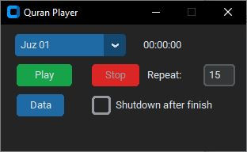

# Quran Player
 Play Quran by Juz with custom repitition

## Screenshots
#### Main

Download and extract [quran mp3] (https://drive.google.com/file/d/1rajL-DTKJeFCVjYUJR9_YSnTpcdnBOBE/view?usp=share_link) to the same directory

Use this command to create exe `pyinstaller --noconfirm --onefile --noconsole --add-data "C:\U
sers\Admin\AppData\Local\Programs\Python\Python311\Lib\site-packages\customtkinter;customtkinter/" app.py`